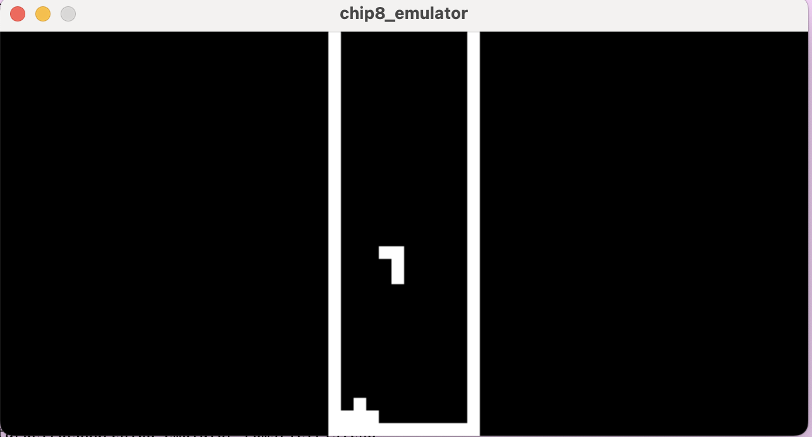

# chip8_emulator

## Usage
	
	chip8_emulator [path of rom file] 
  
Or  

	cargo run -- [path of rom file]
	

## Pre-install
The graphic of chip8_emulator is based on SDL,please install SDL before.
### MacOS

	 brew install sdl2

## Picture

## Clock Rate
Since modern computer is much more powerful than chip8 computer, the progroms of chip8 running in chip8_emulator will be much more faster, hence I set the clock rate 1000 Hz. There is not accurate clock rate for chip8_emulator, perhaps you need to change the duration in `main.rs` to meet your needs.  
 
 	...
    let dura = std::time::Duration::from_millis(1);
    ...

## Timer Clock Rate
Chip8 has two timers, delay timer and sound timer.   
In reality, both are set to 60Hz.  
In my implementation,
both are set to 60 and count down per 16 millsecond.  

	pub unsafe fn delay_timer() {
	    std::thread::spawn(|| loop {
	        if DELAY_TIMER == 0 {
	            DELAY_TIMER = 60;
	        } else {
	            DELAY_TIMER -= 1;
	        }
	        let dura = std::time::Duration::from_millis(16);
	        std::thread::sleep(dura);
	    });
	}
	
	pub unsafe fn sound_timer() {
	    std::thread::spawn(|| loop {
	        if SOUND_TIMER == 0 {
	            SOUND_TIMER = 60;
	        } else {
	            SOUND_TIMER -= 1;
	        }
	        let dura = std::time::Duration::from_millis(16);
	        std::thread::sleep(dura);
	    });
	}

And due to the mechanism of threads, both will not always be the same even there is no functions try to change them.
## Key Mappings
The keyboard layout of a real chip8 computer is like that

	1 2 3 C
	4 5 6 D
	7 8 9 E
	A 0 B F
My key mapping is like that

	1 2 3 4
	Q W E R
	A S D F
	Z X C V

## Packages 
 [clap](https://crates.io/crates/clap) for fast CLI tools development.  
 [SDL2](https://crates.io/crates/sdl2) for Windows and Graphic.  
 [thiserror](https://crates.io/crates/thiserror/1.0.38) for error handling.  
 [lazy_static](https://crates.io/crates/lazy_static) for static std::collections usage(such as static Vector).  
 [spin](https://crates.io/crates/spin) for easy LOCK handling.  

## Reference
[Chip8 wiki](https://en.wikipedia.org/wiki/CHIP-8)
